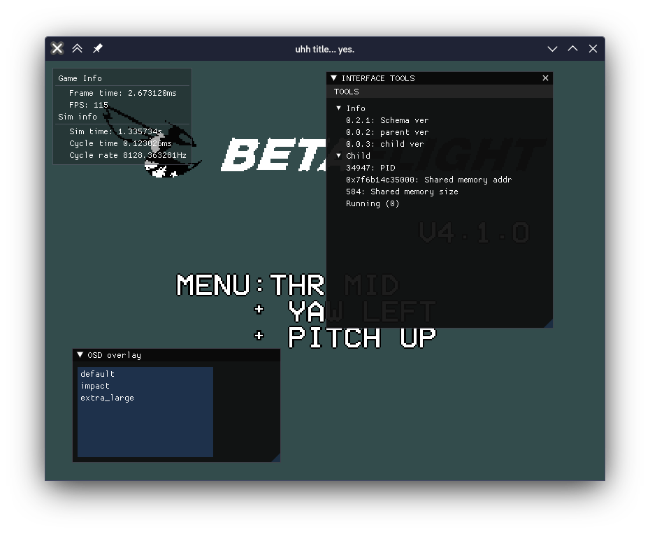

> **Warning**
> WIP

## How to compile for:
* Linux: Install gcc/clang, cmake (more?) from your package manager, should all work well.
* Windows: Install msys2, and install the required packages (gcc, cmake, make, glm, perhaps more?)
* Windows (from Linux): Use mingw-w64, sorta the same as above, also works well (this might currently not work)
## What is this?

This is software that integrates a flight controller and a physics simulator to simulate a quadcopter. This however does not present a user interface, rather, it uses shared memory with a "frontend" process that will present the data to the user, as well as passing necessary parameters to this software. 

I am currently working on a frontend (closed source), a screenshot of the OSD functionality is displayed below:

## How do I use it?

1. Create a named block of shared memory based on the struct in [memdef.h](src/memdef.h) (making use of the initializer list!)
2. Call this process with the name of your shared memory segment as a parameter
3. profit

## License

GPLV3 Licensed.

## Credits

Thanks to:

* https://github.com/betaflight/betaflight (GPLv3)
* https://github.com/timower/KwadSimSITL (GPLv3)
* https://github.com/qduff/quaphy (GPLv3)

also uses boost & GLM

